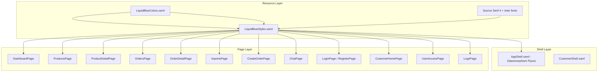

# Design Document: Liquid Blue UI Conversion

## Overview

This design describes the conversion of the "Lumière Liquid Blue" design system from HTML stitch reference files into .NET MAUI XAML for the SyncChain Desktop application. The conversion replaces the current UI styling (dark blue sidebar, flat white cards, OpenSans typography) with a glassmorphism-based visual language featuring semi-transparent surfaces, Source Serif 4 / Inter typography pairing, and a cool blue-tinted color palette.

The approach is a **full visual reskin** of existing pages — the page structure, navigation routes, data models, and code-behind logic remain largely intact while XAML markup and resource dictionaries are replaced to match the Liquid Blue specification.

### Key Design Decisions

1. **Resource Dictionary layering**: A new `LiquidBlueColors.xaml` and `LiquidBlueStyles.xaml` replace the existing `Colors.xaml` and `Styles.xaml` to avoid merge conflicts and allow rollback.
2. **Font registration**: Source Serif 4 and Inter font files are added to `Resources/Fonts/` and registered in `MauiProgram.cs`.
3. **Glassmorphism approximation**: .NET MAUI does not natively support `backdrop-filter: blur()`. Glass effects are approximated using semi-transparent `BackgroundColor` with `Shadow` elements and `Border` with low-opacity stroke. Platform-specific handlers may enhance blur on Windows via composition APIs.
4. **No structural navigation changes**: The existing `AppShell` flyout pattern and route names are preserved. Only visual properties (colors, fonts, templates) change.
5. **Vietnamese text hardcoded in XAML**: Since the app targets a single locale, Vietnamese strings are placed directly in XAML rather than using a `.resx` localization framework.

## Architecture



### Conversion Strategy

The conversion follows a bottom-up approach:

1. **Foundation** — Define design tokens (colors, typography, spacing, radii) in resource dictionaries
2. **Components** — Define reusable styles (GlassCard, PillButton, MinimalistEntry, StatusBadge, etc.)
3. **Shell** — Restyle AppShell flyout with glassmorphism sidebar
4. **Pages** — Convert each page XAML to use new styles and layout patterns

## Components and Interfaces

### Resource Dictionary Components

| Component | File | Purpose |
|-----------|------|---------|
| Color Tokens | `Resources/Styles/Colors.xaml` | All Liquid Blue palette colors |
| Style Definitions | `Resources/Styles/Styles.xaml` | Typography, card, button, input, badge styles |
| Gradient Brush | Defined in Styles.xaml | `LiquidGradientBrush` (135°, #f8f9ff → #e0f2fe → #eff4ff) |

### Reusable Style Keys

```
Typography Styles:
- DisplayXlLabel          (Source Serif 4, 72px, weight 600)
- HeadlineLgLabel         (Source Serif 4, 48px, weight 500)
- HeadlineLgMobileLabel   (Source Serif 4, 32px, weight 500)
- BodyMdLabel             (Inter, 16px, weight 400)
- DataTabularLabel        (Inter, 14px, weight 600)
- LabelCapsLabel          (Inter, 12px, weight 700, uppercase via TextTransform)

Card Styles:
- GlassCardBorder         (60% white bg, 1px white/30% stroke, 24px corners, shadow)

Button Styles:
- PillPrimaryButton       (pill shape, primary bg, white label-caps text)
- PillSecondaryButton     (pill shape, glass bg, primary border)

Input Styles:
- MinimalistEntry         (no bg, bottom border, focus thickening)

Badge Styles:
- StatusBadgePill         (pill shape, contextual color, bold uppercase 10px)
- CategoryBadgePill       (pill shape, primary-container bg)

Layout:
- LiquidGradientBrush     (page background)
- ContentPageStyle        (applies gradient background)
```

### AppShell Interface

```xml
<!-- Flyout structure -->
Shell
├── FlyoutHeader (Logo + brand name in Source Serif 4)
├── FlyoutContent (Navigation items with Material Symbols + label-caps Vietnamese)
├── FlyoutFooter (Hỗ trợ + Đăng xuất with separator border)
└── ShellContent routes (unchanged)
```

### Page Component Patterns

Each page follows a consistent structure:

```xml
<ContentPage Style="{StaticResource ContentPageStyle}">
  <ScrollView>
    <VerticalStackLayout Padding="64,30" Spacing="24">
      <!-- Page Header: display-xl title + action buttons -->
      <!-- Content Sections: Glass_Card containers -->
      <!-- Data Tables: label-caps headers + data-tabular rows -->
      <!-- Pagination: pill buttons with Vietnamese labels -->
    </VerticalStackLayout>
  </ScrollView>
</ContentPage>
```

## Data Models

The existing data models in `Models/AppModels.cs` remain unchanged. The UI conversion is purely visual — it changes how data is presented, not what data exists.

### Model Additions

A few view-model properties may be added to support new visual states:

```csharp
// Extension to ChatMessage for bubble styling
public bool IsDateDivider { get; init; }

// Extension to OrderItem for Liquid Blue status mapping
public string StatusBadgeBackground => Status switch
{
    "Đã giao" => "#dcfce7",       // emerald-100
    "Đang vận chuyển" => "#dbeafe", // blue-100
    "Đang xử lý" => "#fef3c7",    // amber-100
    "Chờ duyệt" => "#f1f5f9",     // slate-100
    _ => "#f1f5f9"
};
```

### Font Assets Required

| Font File | Family Name | Weights |
|-----------|-------------|---------|
| `SourceSerif4-Medium.ttf` | SourceSerif4 | 500 |
| `SourceSerif4-SemiBold.ttf` | SourceSerif4 | 600 |
| `Inter-Regular.ttf` | Inter | 400 |
| `Inter-SemiBold.ttf` | Inter | 600 |
| `Inter-Bold.ttf` | Inter | 700 |
| `MaterialSymbolsOutlined.ttf` | MaterialSymbols | 400 |

### Color Token Mapping

| Token Name | Hex Value | Usage |
|------------|-----------|-------|
| Primary | #50616b | Text emphasis, icon containers |
| PrimaryContainer | #e0f2fe | Highlight backgrounds, active states |
| Surface | #f8f9ff | Base canvas, gradient start/end |
| OnSurface | #0b1c30 | Primary text color |
| OnSurfaceVariant | #43474b | Secondary text |
| Outline | #73787b | Borders, dividers |
| OutlineVariant | #c3c7cb | Subtle borders |
| Error | #ba1a1a | Error states |
| Secondary | #565e74 | Secondary actions |
| SurfaceContainerLowest | #ffffff | Card backgrounds (with opacity) |
| SurfaceContainerLow | #eff4ff | Gradient endpoint |
| SurfaceContainer | #e5eeff | Container fills |
| SurfaceContainerHigh | #dce9ff | Elevated containers |
| SurfaceContainerHighest | #d3e4fe | Highest elevation |
| GlassWhite60 | #99FFFFFF | Glass card background (60% white) |
| GlassBorder30 | #4DFFFFFF | Glass card border (30% white) |
| StatusEmerald | #dcfce7 | Success badge background |
| StatusAmber | #fef3c7 | Warning badge background |
| StatusBlue | #dbeafe | In-progress badge background |
| StatusSlate | #f1f5f9 | Pending badge background |

## Error Handling

### Glassmorphism Fallback Strategy

Since .NET MAUI does not support CSS `backdrop-filter`, the design implements a graceful degradation:

1. **Windows (WinUI3)**: Use `Microsoft.UI.Composition` visual layer for acrylic/blur effects via platform-specific handler if feasible. Fallback to solid semi-transparent background.
2. **Android/iOS/macOS**: Use solid semi-transparent white (`#99FFFFFF`) with elevated shadow to simulate depth. No blur effect.
3. **All platforms**: The `GlassCardBorder` style uses `BackgroundColor="#99FFFFFF"` as the universal baseline that works everywhere.

### Font Loading Failures

If custom fonts fail to load:
- Source Serif 4 falls back to the system serif font
- Inter falls back to the system sans-serif font
- Material Symbols falls back to Unicode text characters (as currently used in the app)

### Missing Image Assets

Hero sections and product images use placeholder containers with:
- Gradient background fill matching the Liquid Blue palette
- Initials or icon fallback (existing pattern in the app)

## Testing Strategy

### Why Property-Based Testing Does Not Apply

This feature is a **UI rendering and styling conversion**. The requirements define:
- Visual properties (colors, fonts, spacing, border radii)
- Layout structure (which elements appear on which pages)
- Static text content (Vietnamese labels)

These are best validated through:
1. **Snapshot/structural tests** — verify XAML structure matches specification
2. **Example-based unit tests** — verify specific style values
3. **Visual regression tests** — compare rendered output against reference screenshots

PBT is not appropriate because:
- There is no meaningful input variation (pages render fixed layouts with bound data)
- The "properties" are really configuration checks (does color X equal hex Y?)
- UI rendering correctness is subjective and visual, not algebraically verifiable

### Test Approach

#### 1. Resource Dictionary Validation (Unit Tests)

Verify that all design tokens are correctly defined:
- All color keys exist with correct hex values
- All typography styles have correct font family, size, and weight
- Spacing and radius constants match specification
- Glass card style has correct opacity, border, and corner values

#### 2. Page Structure Tests (Integration Tests)

For each converted page, verify:
- Page uses `LiquidGradientBrush` as background
- Glass_Card containers are present in expected locations
- Vietnamese text labels match specification
- Navigation items have correct routes and labels

#### 3. Visual Consistency Tests (Manual + Automated)

- Compare each page against the HTML stitch reference screenshots
- Verify glassmorphism effect renders acceptably on each target platform
- Verify typography hierarchy is visually correct (serif headlines, sans-serif data)
- Verify color palette contains no green/teal/yellow tones

#### 4. Cross-Platform Smoke Tests

Run the application on each target platform and verify:
- Fonts load correctly (Source Serif 4, Inter)
- Gradient backgrounds render without artifacts
- Glass card semi-transparency is visible
- Navigation flyout opens and closes correctly
- All pages are reachable via navigation

#### 5. Regression Tests

- Existing navigation routes still work
- Data binding still populates pages correctly
- Code-behind event handlers still fire
- No XAML compilation errors on any target framework

### Test Tools

- **xUnit** for unit tests validating resource dictionary values
- **.NET MAUI TestFramework** or **Appium** for UI automation
- **Manual testing** for visual fidelity comparison against stitch files
