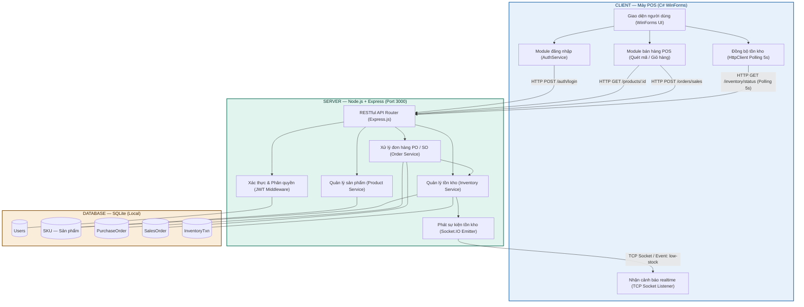

# 🏪 RetailOps — Hệ thống quản lý vận hành chuỗi bán lẻ

> Đồ án môn **Lập trình mạng căn bản** — Mô hình Client/Server

---

## 📋 Mục lục

- [Giới thiệu](#giới-thiệu)
- [Kiến trúc hệ thống](#kiến-trúc-hệ-thống)
- [Sơ đồ kiến trúc](#sơ-đồ-kiến-trúc)
- [Luồng dữ liệu](#luồng-dữ-liệu)
- [Công nghệ sử dụng](#công-nghệ-sử-dụng)
- [Cài đặt & Chạy thử](#cài-đặt--chạy-thử)
- [Thành viên nhóm](#thành-viên-nhóm)

---

## Giới thiệu

**RetailOps** là hệ thống quản lý vận hành chuỗi bán lẻ được xây dựng theo mô hình **Client – Server**, cho phép:

- Xác thực người dùng và phân quyền (Admin / Nhân viên / Nhà phân phối / Khách hàng)
- Quản lý sản phẩm và tồn kho theo thời gian thực
- Xử lý đơn hàng bán lẻ (Sales Order) và đơn nhập hàng (Purchase Order)
- Cảnh báo tồn kho thấp tức thời qua TCP Socket
- Báo cáo và thống kê đơn hàng

---

## Kiến trúc hệ thống

Hệ thống được chia thành 3 tầng độc lập:

| Tầng | Công nghệ | Vai trò |
|------|-----------|---------|
| **Client** | C# WinForms | Giao diện máy POS, giao tiếp với Server qua HTTP & Socket |
| **Server** | Node.js + Express | RESTful API, xử lý nghiệp vụ, phát sự kiện realtime |
| **Database** | SQLite | Lưu trữ dữ liệu cục bộ trên máy Server |

---

## Sơ đồ kiến trúc



---

## Luồng dữ liệu

**1. Đăng nhập**
```
WinForms → HTTP POST /auth/login → JWT verify → trả về token
```

**2. Bán hàng (POS)**
```
Quét mã → HTTP GET /products/:id → hiển thị giỏ hàng
Xác nhận đơn → HTTP POST /orders/sales → ghi SalesOrder + trừ tồn kho
```

**3. Đồng bộ tồn kho (Polling)**
```
HttpClient gọi HTTP GET /inventory/status mỗi 5 giây
→ Server truy vấn SQLite → trả JSON về Client cập nhật UI
```

**4. Cảnh báo tồn kho thấp (Realtime)**
```
INV_SVC phát hiện SoLuongTon < MucTonThap
→ Socket.IO emit "low-stock" → TCP → Client hiển thị cảnh báo ngay lập tức
```

**5. Đặt hàng nhà máy (Purchase Order)**
```
WinForms → HTTP POST /orders/purchase → PO Service → ghi PurchaseOrder
→ Khi duyệt: cập nhật SoLuongTon trong SKU
```

---

## Công nghệ sử dụng

### Client
- **Ngôn ngữ:** C# (.NET WinForms)
- **Thư viện:** `HttpClient`, `System.Net.Sockets`, `Newtonsoft.Json`

### Server
- **Runtime:** Node.js
- **Framework:** Express.js
- **Realtime:** Socket.IO
- **Xác thực:** JWT (jsonwebtoken)
- **Port:** `3000`

### Database
- **Engine:** SQLite
- **Thư viện:** `better-sqlite3`
- **Bảng chính:** `Users`, `SKU`, `PurchaseOrder`, `SalesOrder`, `InventoryTxn`

---

## Cài đặt & Chạy thử

### Yêu cầu
- Node.js >= 18
- .NET >= 6.0

### Chạy Server

```bash
cd server
npm install
node index.js
# Server lắng nghe tại http://localhost:3000
```

### Chạy Client

Mở file `.sln` bằng Visual Studio, build và chạy.  
Đảm bảo Server đang chạy trước khi mở Client.

---

## Thành viên nhóm

| Họ tên                      |   MSSV   |
|-----------------------------|----------|
| Nguyễn Đỗ Ngọc Huyền Thương | 24521750 |
| Tăng Thanh Thư              | 24521731 |
| Mai Lương Khánh Vy          | 24522057 |
---
